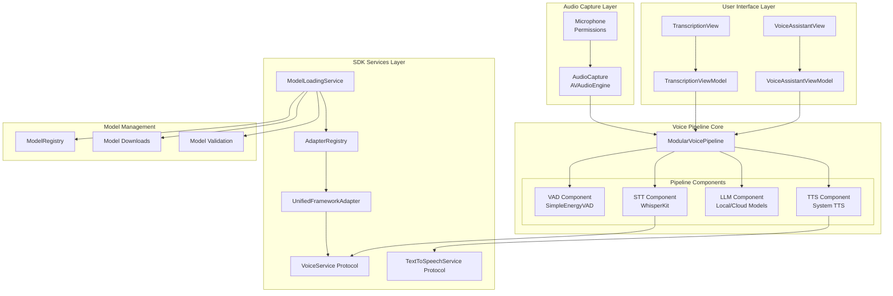
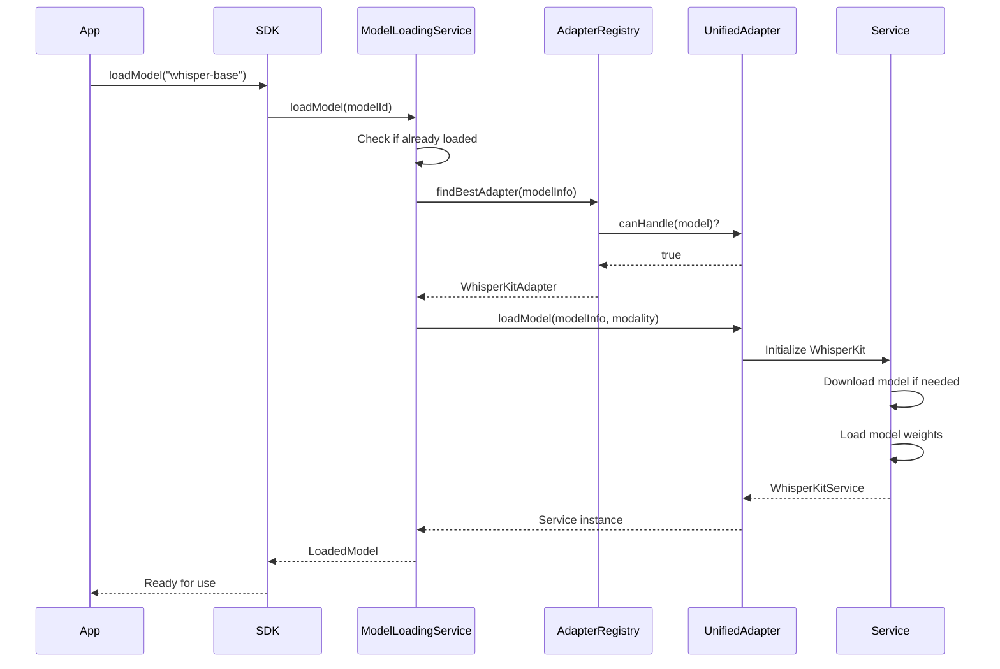
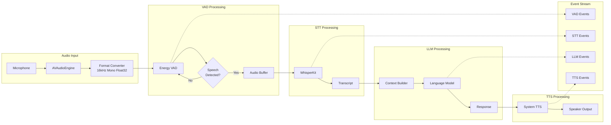
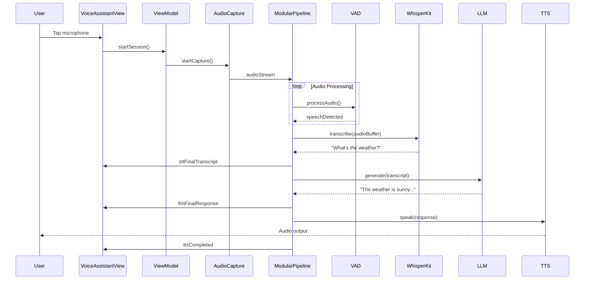
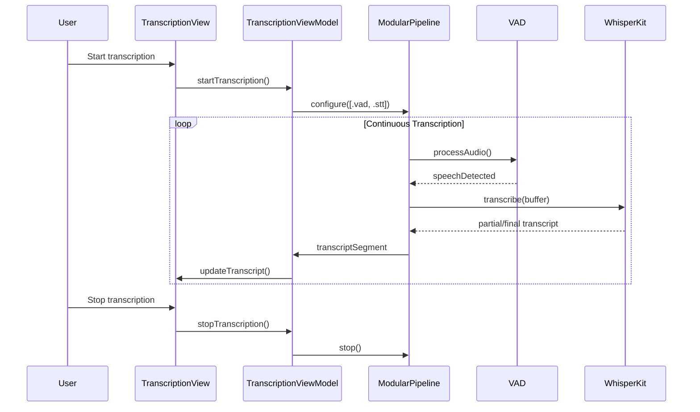

# Complete Voice Pipeline Architecture Documentation

## Table of Contents
1. [Executive Summary](#executive-summary)
2. [High-Level Architecture](#high-level-architecture)
3. [Component Architecture](#component-architecture)
4. [Model Loading & Initialization](#model-loading--initialization)
5. [Voice Service Implementation](#voice-service-implementation)
6. [Data Flow Architecture](#data-flow-architecture)
7. [Integration Points](#integration-points)
8. [Sequence Diagrams](#sequence-diagrams)
9. [Implementation Guidelines](#implementation-guidelines)

---

## Executive Summary

The RunAnywhere Voice Pipeline is a modular, privacy-first voice AI system designed for on-device processing with optional cloud fallback. The architecture supports flexible component composition allowing developers to use individual components (transcription-only) or complete pipelines (VAD → STT → LLM → TTS).

### Key Features
- **Modular Architecture**: Mix and match VAD, STT, LLM, and TTS components
- **On-Device First**: All processing happens locally by default
- **Real-Time Processing**: Streaming support with <100ms latency targets
- **Framework Agnostic**: Supports WhisperKit, CoreML, MLX, ONNX, TFLite
- **Event-Driven**: Reactive architecture with comprehensive event system

---

## High-Level Architecture



---

## Component Architecture

### 1. Audio Capture System

**AudioCapture.swift**
```swift
// Core Audio Pipeline
AVAudioEngine → AVAudioInputNode → Audio Format Conversion → Float Samples Stream

// Configuration
- Sample Rate: 16kHz (optimized for speech)
- Format: Mono, Float32
- Buffer Size: 1024 frames
- Chunk Duration: 100ms (1600 samples)
```

### 2. Voice Activity Detection (VAD)

**SimpleEnergyVAD Implementation**
```swift
// Energy-Based Detection Algorithm
1. Calculate RMS energy: √(Σ(x²)/n)
2. Apply hysteresis thresholds:
   - Speech Start: energy > threshold * 1.2
   - Speech End: energy < threshold * 0.8
3. Frame-based analysis (100ms frames)
4. Minimum speech duration: 1.0 seconds

// Configuration
- Energy Threshold: 0.022 (adjustable)
- Hysteresis Factor: 1.5
- Min Speech Duration: 1.0s
- Frame Length: 100ms
```

### 3. Speech-to-Text (STT)

**WhisperKit Integration**
```swift
// Model Variants
- whisper-tiny: 3MB, fastest, lower accuracy
- whisper-base: 145MB, balanced
- whisper-small: 487MB, good accuracy
- whisper-medium: 1.5GB, high accuracy
- whisper-large: 3.1GB, best accuracy

// Audio Processing Pipeline
Float Samples → WhisperKit Encoder → Decoder → Text Output
```

### 4. Language Model (LLM)

**LLM Service Integration**
```swift
// Supported Frameworks
- MLX Models (Apple Silicon optimized)
- GGUF Models (quantized)
- CoreML Models
- Cloud Fallback (OpenAI, Anthropic)

// Processing Flow
Transcript → Context Building → Generation → Response
```

### 5. Text-to-Speech (TTS)

**System TTS Service**
```swift
// AVSpeechSynthesizer Pipeline
Text → AVSpeechUtterance → Voice Selection → Audio Output

// Configuration
- Voice: System voices by identifier
- Rate: 0.0 - 1.0 (default: 0.5)
- Pitch: 0.5 - 2.0 (default: 1.0)
- Volume: 0.0 - 1.0 (default: 1.0)
```

---

## Model Loading & Initialization

### Model Loading Architecture



### WhisperKit Model Initialization

```swift
// Step 1: Model Path Resolution
let modelPath = resolveModelPath(modelName: "whisper-base")
// Checks: ~/Library/Caches/WhisperKit/models/

// Step 2: Model Download (if needed)
if !FileManager.default.fileExists(atPath: modelPath) {
    await downloadModel(from: huggingFaceRepo)
}

// Step 3: WhisperKit Initialization
let whisperKit = try await WhisperKit(
    computeUnits: .cpuAndNeuralEngine,
    verbose: true,
    logLevel: .debug,
    prewarm: true,
    load: true,
    download: true
)

// Step 4: Model Loading
try await whisperKit.loadModels(modelPath: modelPath)

// Step 5: Service Registration
adapterRegistry.register(WhisperKitService(whisperKit))
```

### LLM Model Initialization

```swift
// Step 1: Model Discovery
let modelInfo = modelRegistry.getModel(by: "llama-3.2-1b")

// Step 2: Framework Selection
let adapter = adapterRegistry.findBestAdapter(for: modelInfo)
// Checks: MLX > GGUF > CoreML > Cloud

// Step 3: Memory Check
let canAllocate = memoryManager.canAllocate(modelInfo.estimatedMemory)

// Step 4: Model Loading
let service = try await adapter.loadModel(modelInfo, for: .textToText)

// Step 5: Service Configuration
service.configure(with: HardwareConfiguration(
    useGPU: true,
    useNeuralEngine: true,
    maxMemory: 4_000_000_000 // 4GB
))
```

---

## Voice Service Implementation

### Creating a Custom Voice Service

```swift
// Step 1: Implement VoiceService Protocol
public class CustomVoiceService: VoiceService {
    // Required properties
    public var preferredAudioFormat: VoiceServiceAudioFormat { .floatArray }
    public var isReady: Bool { model != nil }
    public var currentModel: String? { modelName }

    // Required methods
    public func initialize(modelPath: String?) async throws {
        // Load your model here
    }

    public func transcribe(
        samples: [Float],
        options: VoiceTranscriptionOptions
    ) async throws -> VoiceTranscriptionResult {
        // Implement transcription logic
    }

    // Optional streaming support
    public func transcribeStream(
        audioStream: AsyncStream<VoiceAudioChunk>,
        options: VoiceTranscriptionOptions
    ) -> AsyncThrowingStream<VoiceTranscriptionSegment, Error> {
        // Implement streaming transcription
    }
}

// Step 2: Create Framework Adapter
public class CustomVoiceAdapter: UnifiedFrameworkAdapter {
    public var framework: LLMFramework { .custom }
    public var supportedModalities: Set<FrameworkModality> { [.voiceToText] }

    public func loadModel(
        _ model: ModelInfo,
        for modality: FrameworkModality
    ) async throws -> Any {
        let service = CustomVoiceService()
        try await service.initialize(modelPath: model.localPath?.path)
        return service
    }
}

// Step 3: Register with SDK
RunAnywhereSDK.shared.adapterRegistry.register(CustomVoiceAdapter())
```

---

## Data Flow Architecture

### Complete Voice Pipeline Flow



### Audio Format Transformations

```swift
// 1. Microphone Input (AVAudioEngine)
// Format: 48kHz, Stereo, Float32

// 2. Format Conversion
// Target: 16kHz, Mono, Float32
AVAudioConverter.convert(
    from: inputFormat,
    to: AVAudioFormat(
        commonFormat: .pcmFormatFloat32,
        sampleRate: 16000,
        channels: 1,
        interleaved: false
    )
)

// 3. Audio Chunks
struct VoiceAudioChunk {
    let samples: [Float]      // Float array
    let timestamp: Date
    let sampleRate: Double    // 16000
    let channels: Int         // 1
}

// 4. Service-Specific Formats
if service.preferredAudioFormat == .floatArray {
    // Pass Float array directly
    service.transcribe(samples: chunk.samples)
} else {
    // Convert to Data
    let data = chunk.samples.withUnsafeBytes { Data($0) }
    service.transcribe(audio: data)
}
```

---

## Integration Points

### 1. SDK Integration

```swift
// Initialize SDK
RunAnywhereSDK.shared.initialize(
    apiKey: "your-api-key",
    config: Configuration(
        defaultFramework: .whisperKit,
        enableVoice: true
    )
)

// Create Voice Pipeline
let pipeline = ModularVoicePipeline(
    config: ModularPipelineConfig(
        components: [.vad, .stt, .llm, .tts],
        vad: VADConfig(energyThreshold: 0.022),
        stt: VoiceSTTConfig(modelId: "whisper-base"),
        llm: VoiceLLMConfig(modelId: "llama-3.2-1b"),
        tts: VoiceTTSConfig(voice: "com.apple.ttsbundle.Samantha")
    )
)

// Process Audio Stream
let audioCapture = AudioCapture()
let audioStream = try await audioCapture.startCapture()

for await event in pipeline.process(audioStream: audioStream) {
    switch event {
    case .vadSpeechStart:
        // Update UI: Show listening indicator
    case .sttFinalTranscript(let text):
        // Display transcript
    case .llmFinalResponse(let response):
        // Show AI response
    case .ttsCompleted:
        // Hide speaking indicator
    }
}
```

### 2. Framework Adapter Registry

```swift
// Built-in Adapters
- WhisperKitAdapter: Speech-to-text using WhisperKit
- MLXAdapter: LLM inference using MLX framework
- GGUFAdapter: Quantized model support
- CoreMLAdapter: Apple's Core ML models
- TransformersAdapter: Hugging Face models

// Adapter Selection Logic
1. Check model's preferredFramework
2. Verify framework availability
3. Check hardware compatibility
4. Select best adapter based on:
   - Performance characteristics
   - Memory requirements
   - Feature support
```

### 3. Service Discovery

```swift
// Find Voice Service
let voiceService = RunAnywhereSDK.shared.findVoiceService(
    modelId: "whisper-base"
)

// Find TTS Service
let ttsService = RunAnywhereSDK.shared.findTTSService(
    voice: "com.apple.ttsbundle.Samantha"
)

// Find LLM Service
let llmService = RunAnywhereSDK.shared.findLLMService(
    modelId: "llama-3.2-1b"
)
```

---

## Sequence Diagrams

### Full Conversation Flow



### Transcription-Only Flow



---

## Implementation Guidelines

### Best Practices

1. **Memory Management**
   - Cache service instances for 5 minutes
   - Clear audio buffers after processing
   - Monitor memory usage during model loading

2. **Error Handling**
   - Implement fallback for each component
   - Provide meaningful error messages
   - Log errors with appropriate privacy levels

3. **Performance Optimization**
   - Use Float arrays for audio when possible
   - Process audio in chunks (100ms)
   - Implement async/await for non-blocking operations

4. **Audio Session Management**
   ```swift
   // iOS Audio Session Setup
   let session = AVAudioSession.sharedInstance()
   try session.setCategory(.playAndRecord, options: [.defaultToSpeaker])
   try session.setActive(true)
   ```

5. **Model Selection**
   ```swift
   // Choose model based on device capabilities
   let deviceMemory = ProcessInfo.processInfo.physicalMemory
   let modelSize = deviceMemory > 8_000_000_000 ? "medium" : "base"
   ```

### Testing Strategies

1. **Unit Tests**
   - Test each component independently
   - Mock audio streams for consistent testing
   - Verify error handling paths

2. **Integration Tests**
   - Test complete pipeline flows
   - Verify component interactions
   - Test fallback mechanisms

3. **Performance Tests**
   - Measure transcription latency
   - Monitor memory usage
   - Test with various audio conditions

### Debugging Tips

1. **Enable Verbose Logging**
   ```swift
   SDKLogger.setLogLevel(.debug)
   WhisperKit.verbose = true
   ```

2. **Monitor Pipeline Events**
   ```swift
   for await event in pipeline.process(audioStream) {
       print("Pipeline Event: \(event)")
   }
   ```

3. **Check Audio Format**
   ```swift
   print("Sample Rate: \(chunk.sampleRate)")
   print("Channels: \(chunk.channels)")
   print("Samples: \(chunk.samples.count)")
   ```

---

## Conclusion

The RunAnywhere Voice Pipeline provides a comprehensive, modular solution for voice AI applications. Its architecture supports flexible configuration, efficient on-device processing, and seamless integration with various ML frameworks. The event-driven design ensures responsive user experiences while the abstraction layers enable easy customization and extension.

Key strengths:
- **Modularity**: Use only the components you need
- **Performance**: Optimized for real-time processing
- **Privacy**: On-device first approach
- **Flexibility**: Support for multiple frameworks and models
- **Extensibility**: Easy to add custom implementations

This architecture serves as the foundation for building sophisticated voice-enabled applications while maintaining simplicity and performance.
