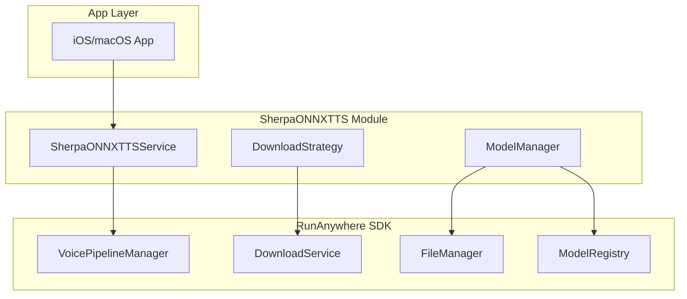

# Sherpa-ONNX TTS Integration - Complete Implementation Plan

## Executive Summary

This document consolidates the complete plan for integrating Sherpa-ONNX TTS into the RunAnywhere SDK. The implementation follows the proven FluidAudioDiarization pattern, where the TTS module is a separate package that depends on the SDK, leveraging all existing model downloading, caching, and file management infrastructure.

### Key Deliverables
- **Standalone TTS module** using Sherpa-ONNX framework
- **Multiple voice models** (KittenTTS 25MB, Kokoro 100MB, VITS 50-150MB)
- **Streaming synthesis** support for low-latency responses
- **Seamless integration** with existing voice pipeline
- **UI updates** in VoiceAssistantView to show TTS model selection

### Quality Improvements
- 3-5x quality improvement over Apple's AVSpeechSynthesizer
- Multiple voice options with different characteristics
- Support for emotional expression and voice variety
- Better language support (30+ languages with VITS/Piper)

---

## Current State Analysis

### Existing Voice Pipeline Architecture
- **5-Layer Architecture**: Foundation → Infrastructure → Core → Capabilities → Public
- **Modular Design**: VAD → STT → LLM → TTS components
- **Protocol-Based**: Well-defined `TextToSpeechService` protocol with streaming support
- **Audio Format**: Standardized 16kHz, Float32, mono
- **Pipeline Management**: `VoicePipelineManager` with `ModularPipelineConfig`
- **Event System**: `ModularPipelineEvent` for real-time updates

### SDK Model Management Infrastructure (Already Available)
- **Download Service**: `AlamofireDownloadService` with progress tracking
- **File Management**: `SimplifiedFileManager` with framework-specific folders
- **Model Registry**: `RegistryService` for model metadata and discovery
- **Cache Management**: Built-in cache with TTL support
- **Download Strategies**: Extensible strategy pattern for custom downloads

---

## ✅ Work Already Completed

### 1. SDK Module Support Extensions (Restructured into multiple files)
- ✅ **`RunAnywhereSDK+ModuleCore.swift`**: Core module support, file management, model registration
- ✅ **`RunAnywhereSDK+ModuleUtilities.swift`**: Integration helpers, lifecycle support, error handling
- ✅ **`RunAnywhereSDK+VoiceModules.swift`**: TTS/STT module support, voice factory
- ✅ **`RunAnywhereSDK+LLMModules.swift`**: LLM module support for future expansion
- ✅ Framework storage directory access
- ✅ Module cache management APIs
- ✅ Download service exposure for modules
- ✅ Model registration helpers
- ✅ Module integration utilities
- ✅ `ModuleFileManagementProtocol` for controlled file access
- ✅ **SDK BUILDS SUCCESSFULLY**: All compilation errors fixed

### 2. TTS Configuration Updates (`VoiceTTSConfig.swift`)
- ✅ Added `TTSProvider` enum (system, sherpaONNX, custom)
- ✅ Model ID support for neural TTS providers
- ✅ Convenience initializers for different providers
- ✅ Backward compatibility maintained

### 3. Architecture Decisions
- ✅ **NO ADAPTER NEEDED**: Direct module instantiation following FluidAudioDiarization pattern
- ✅ Updated plan to use `VoicePipelineManager` instead of deprecated `ModularVoicePipeline`
- ✅ Aligned with 5-layer architecture
- ✅ Clean separation of concerns in module support files

### 4. Documentation
- ✅ **Module Development Guide Created** (`docs/MODULE_DEVELOPMENT_GUIDE.md`)
- ✅ Two integration patterns documented (self-contained vs SDK-integrated)
- ✅ Best practices from FluidAudioDiarization analysis included
- ✅ Complete SDK API reference for modules
- ✅ Real-world examples and testing strategies

### 5. SDK Build Status
- ✅ **SDK compiles successfully** with all module support extensions
- ✅ Fixed all compilation errors in module support files
- ✅ Proper handling of protocol instantiation limitations

---

## Architecture Overview

### Module Structure (Following FluidAudioDiarization Pattern)

```
sdk/runanywhere-swift/
├── Sources/RunAnywhere/                    # Main SDK
│   ├── Capabilities/Voice/Handlers/
│   │   └── TTSHandler.swift                # [TODO] Update to support direct module integration
│   └── Public/
│       ├── Extensions/ModuleSupport/       # ✅ COMPLETED (New structure)
│       │   ├── RunAnywhereSDK+ModuleCore.swift       # Core module support
│       │   ├── RunAnywhereSDK+ModuleUtilities.swift  # Integration helpers
│       │   ├── RunAnywhereSDK+VoiceModules.swift     # Voice module support
│       │   └── RunAnywhereSDK+LLMModules.swift       # LLM module support
│       └── Models/Voice/
│           └── VoiceTTSConfig.swift        # ✅ COMPLETED
│
└── Modules/SherpaONNXTTS/                  # [TODO] Separate module package
    ├── Package.swift                        # Depends on RunAnywhereSDK
    ├── Sources/
    │   └── SherpaONNXTTS/
    │       ├── Public/
    │       │   ├── SherpaONNXTTSService.swift
    │       │   └── SherpaONNXConfiguration.swift
    │       ├── Internal/
    │       │   ├── Models/
    │       │   │   ├── SherpaONNXModelManager.swift
    │       │   │   ├── SherpaONNXDownloadStrategy.swift
    │       │   │   └── SherpaONNXModelRegistry.swift
    │       │   ├── Audio/
    │       │   │   ├── AudioProcessor.swift
    │       │   │   └── AudioFormatConverter.swift
    │       │   ├── TextProcessing/
    │       │   │   ├── TextNormalizer.swift
    │       │   │   └── PhonemeConverter.swift
    │       │   └── Bridge/
    │       │       ├── SherpaONNXWrapper.swift
    │       │       └── CCallbackBridge.swift
    │       └── Resources/
    │           └── ModelConfigs/
    └── XCFrameworks/
        ├── sherpa-onnx.xcframework          # [TODO] Build from source
        └── onnxruntime.xcframework          # [TODO] Build from source
```

### Component Dependencies



---

## Sherpa-ONNX Framework Analysis

### Supported Models
| Model Type | Size | Voices | Quality | Languages | Model ID |
|------------|------|--------|---------|-----------|----------|
| KittenTTS | 25MB | 8 | Good | English | sherpa-kitten-nano-v0.1 |
| Kokoro | 100MB | 11+ | Excellent | Multi | sherpa-kokoro-en-v0.19 |
| VITS/Piper | 50-150MB | Varies | Good | 30+ | sherpa-vits-{lang} |
| Matcha | 100-300MB | Varies | Best | Multi | sherpa-matcha-{lang} |

### Technical Requirements
- **Platform**: iOS 13.0+ / macOS 10.15+
- **Architecture**: C++ core → C API → Swift bindings
- **Dependencies**: ONNX Runtime 1.17.1
- **Memory**: 50-300MB depending on model
- **Performance**: Real-time factor > 10x

---

## Implementation Details

### Phase 1: XCFramework Setup [Week 1]

#### 1.1 Build Sherpa-ONNX XCFramework
```bash
# Clone and build Sherpa-ONNX
cd EXTERNAL/sherpa-onnx
./build-ios.sh

# Create XCFramework
xcodebuild -create-xcframework \
    -framework build-ios/ios/sherpa-onnx.framework \
    -framework build-ios/simulator/sherpa-onnx.framework \
    -output sherpa-onnx.xcframework
```

#### 1.2 Module Package.swift
```swift
// swift-tools-version: 5.9
import PackageDescription

let package = Package(
    name: "SherpaONNXTTS",
    platforms: [.iOS(.v13), .macOS(.v10_15)],
    products: [
        .library(name: "SherpaONNXTTS", targets: ["SherpaONNXTTS"])
    ],
    dependencies: [
        .package(path: "../../"),  // RunAnywhereSDK dependency
    ],
    targets: [
        .target(
            name: "SherpaONNXTTS",
            dependencies: [
                .product(name: "RunAnywhereSDK", package: "runanywhere-swift"),
                "SherpaONNXFramework",
                "ONNXRuntimeFramework"
            ]
        ),
        .binaryTarget(
            name: "SherpaONNXFramework",
            path: "XCFrameworks/sherpa-onnx.xcframework"
        ),
        .binaryTarget(
            name: "ONNXRuntimeFramework",
            path: "XCFrameworks/onnxruntime.xcframework"
        )
    ]
)
```

### Phase 2: Core Service Implementation [Week 2-3]

#### 2.1 Model Registration with SDK
```swift
import RunAnywhereSDK

public class SherpaONNXModelManager {
    private let sdk: RunAnywhereSDK

    public init(sdk: RunAnywhereSDK = .shared) {
        self.sdk = sdk
        registerSherpaModels()
    }

    private func registerSherpaModels() {
        // Register models with SDK's registry
        let models = [
            ModelInfo(
                id: "sherpa-kitten-nano-v0.1",
                name: "Kitten TTS Nano",
                framework: .custom("sherpa-onnx"),
                format: .onnx,
                downloadURL: URL(string: "https://huggingface.co/KittenML/kitten-tts-nano-0.1/resolve/main/model.onnx"),
                downloadSize: 25_000_000,
                estimatedMemoryUsage: 50_000_000,
                alternativeDownloadURLs: [
                    URL(string: "https://huggingface.co/KittenML/kitten-tts-nano-0.1/resolve/main/voices.json"),
                    URL(string: "https://huggingface.co/KittenML/kitten-tts-nano-0.1/resolve/main/tokens.txt")
                ]
            ),
            // Add more models...
        ]

        sdk.registerModuleModels(models)
    }
}
```

#### 2.2 Download Strategy
```swift
import RunAnywhereSDK

public class SherpaONNXDownloadStrategy: DownloadStrategy {
    public var identifier: String { "sherpa-onnx-tts" }

    public func canHandle(model: ModelInfo) -> Bool {
        return model.id.hasPrefix("sherpa-")
    }

    public func downloadModel(
        _ model: ModelInfo,
        using downloadManager: DownloadManager,
        to destination: URL
    ) async throws -> DownloadTask {
        // Handle multi-file downloads for TTS models
        // Download main model + voices.json + tokens.txt
    }
}
```

#### 2.3 TTS Service Implementation
```swift
import Foundation
import RunAnywhereSDK
import AVFoundation

public final class SherpaONNXTTSService: TextToSpeechService {
    private let sdk: RunAnywhereSDK
    private let modelManager: SherpaONNXModelManager
    private var wrapper: SherpaONNXWrapper?
    private var currentModelId: String?

    public init(sdk: RunAnywhereSDK = .shared) {
        self.sdk = sdk
        self.modelManager = SherpaONNXModelManager(sdk: sdk)
    }

    public func initialize() async throws {
        // Register download strategy
        sdk.registerModuleDownloadStrategy(SherpaONNXDownloadStrategy())

        // Select and download model using SDK infrastructure
        let modelId = selectOptimalModel()

        if !sdk.isModelDownloaded(modelId) {
            _ = try await sdk.downloadModel(modelId)
        }

        // Get local path from SDK
        guard let localPath = await sdk.getModelLocalPath(for: modelId) else {
            throw SherpaONNXError.modelNotFound
        }

        // Initialize Sherpa-ONNX wrapper
        let config = SherpaONNXConfiguration(modelPath: localPath.path)
        wrapper = try SherpaONNXWrapper(config: config)
        currentModelId = modelId
    }

    // Implement TextToSpeechService protocol methods...
}
```

### Phase 3: SDK Integration [Week 4] - UPDATED

#### ❌ 3.1 SherpaONNXTTSAdapter - NOT NEEDED
After analysis, we determined that an adapter is **not necessary**. Following the FluidAudioDiarization pattern:
- Modules are directly instantiated when available
- `NSClassFromString` is used for dynamic discovery
- The module itself handles all initialization
- This simplifies the architecture and removes unnecessary abstraction

#### 3.1 Capabilities Layer - TTSHandler Update (Direct Integration)
```swift
// Location: Capabilities/Voice/Handlers/TTSHandler.swift
public class TTSHandler {
    private var ttsService: TextToSpeechService?

    public func configureTTS(config: VoiceTTSConfig) async throws {
        switch config.provider {
        case .system:
            ttsService = SystemTextToSpeechService()
        case .sherpaONNX:
            // Direct module instantiation - no adapter needed
            ttsService = VoiceModuleFactory.createTTSService(from: config)
        case .custom:
            // Handle custom TTS
        }

        try await ttsService?.initialize()
    }
}
```

### Phase 4: Text & Audio Processing [Week 5]

#### 4.1 Text Processing Components
- **TextNormalizer**: Expand abbreviations, convert numbers to words
- **PhonemeConverter**: Convert text to phonemes for better pronunciation
- **SSMLParser**: Support SSML markup for advanced control

#### 4.2 Audio Processing Components
- **AudioProcessor**: Normalization, compression, artifact removal
- **StreamingAudioBuffer**: Handle streaming synthesis
- **AudioFormatConverter**: Convert between formats (Float32 ↔ Int16)

### Phase 5: Testing & Polish [Week 6]

#### 5.1 Testing Strategy
- Unit tests for each component
- Integration tests with VoicePipelineManager
- Performance benchmarks (target: >10x real-time)
- Memory usage tests (target: <200MB for KittenTTS)
- A/B testing vs system TTS

#### 5.2 UI Updates
- Update VoiceAssistantView ModelBadge to show TTS model
- Add voice selection picker
- Show download progress for models

---

## Model Management Details

### Download URLs and Structure

#### KittenTTS
```
Base: https://huggingface.co/KittenML/kitten-tts-nano-0.1/resolve/main/
Files:
- model.onnx (24MB) - Main model file
- voices.json (500KB) - Voice embeddings
- tokens.txt (10KB) - Token mappings
- config.json (1KB) - Model configuration
```

#### Kokoro
```
Base: https://huggingface.co/hexgrad/Kokoro-82M/resolve/main/
Files:
- model.onnx (82MB) - Main model
- voices.bin (10MB) - Voice data
- tokens.txt (10KB) - Tokens
- espeak-ng-data.tar.gz (8MB) - Phoneme data
```

### Storage Structure
```
Documents/RunAnywhere/
└── Models/
    └── sherpa-onnx/              # Framework folder
        ├── sherpa-kitten-nano-v0.1/
        │   ├── model.onnx
        │   ├── voices.json
        │   ├── tokens.txt
        │   └── config.json
        └── sherpa-kokoro-en-v0.19/
            ├── model.onnx
            ├── voices.bin
            ├── tokens.txt
            └── espeak-ng-data/
```

---

## Performance Targets

| Metric | Target | Notes |
|--------|--------|-------|
| Time to First Byte | < 100ms | Initial audio generation |
| Real-time Factor | > 10x | Generation speed vs audio duration |
| Memory Usage | < 200MB | For KittenTTS model |
| CPU Usage | < 30% | On iPhone 12 |
| Audio Quality | > 4.0 MOS | Mean Opinion Score |

---

## Integration Checklist

### SDK Enhancements ✅ COMPLETED
- [x] ~~Create `RunAnywhereSDK+ModuleSupport.swift`~~ Restructured into multiple files:
  - [x] `RunAnywhereSDK+ModuleCore.swift` - Core functionality
  - [x] `RunAnywhereSDK+ModuleUtilities.swift` - Helper utilities
  - [x] `RunAnywhereSDK+VoiceModules.swift` - Voice module support
  - [x] `RunAnywhereSDK+LLMModules.swift` - LLM module support
- [x] Add framework storage directory access
- [x] Expose download service for modules
- [x] Add model registration helpers
- [x] Update `VoiceTTSConfig` with provider support
- [x] Add `TTSProvider` enum
- [x] Fix all compilation errors and verify SDK builds

### Module Creation [TODO]
- [ ] Create `Modules/SherpaONNXTTS` directory structure
- [ ] Build sherpa-onnx.xcframework
- [ ] Build onnxruntime.xcframework
- [ ] Create Package.swift with SDK dependency
- [ ] Implement `SherpaONNXTTSService`
- [ ] Implement `SherpaONNXModelManager`
- [ ] Implement `SherpaONNXDownloadStrategy`
- [ ] Create `SherpaONNXWrapper` for native bridge
- [ ] Add text processing components
- [ ] Add audio processing components

### SDK Integration [TODO]
- [ ] Update `TTSHandler` in Capabilities layer for direct module integration
- [ ] Update `VoiceModuleFactory` to handle SherpaONNX instantiation
- [ ] Update `ModularPipelineEvent` for TTS events
- [ ] Test with `VoicePipelineManager`

### UI & Documentation [TODO]
- [ ] Update VoiceAssistantViewModel
- [ ] Update VoiceAssistantView ModelBadge
- [ ] Add voice selection UI
- [ ] Update VOICE_PIPELINE_ARCHITECTURE.md
- [ ] Add usage examples
- [ ] Create README for module

---

## Usage Examples

### Basic Integration
```swift
import RunAnywhereSDK
import SherpaONNXTTS  // Module auto-registers on import

// Configure pipeline with Sherpa-ONNX TTS
let config = ModularPipelineConfig(
    components: [.vad, .stt, .llm, .tts],
    tts: VoiceTTSConfig.sherpaONNX(
        modelId: "sherpa-kitten-nano-v0.1",
        voice: "expr-voice-2-f"
    )
)

let pipeline = sdk.createVoicePipeline(config: config)
```

### Direct TTS Usage
```swift
// Create standalone TTS service
let ttsService = SherpaONNXTTSService()
try await ttsService.initialize()

// Generate speech
let audioData = try await ttsService.synthesize(
    text: "Hello, world!",
    options: TTSOptions(voice: "expr-voice-3-m", rate: 1.0)
)
```

### Streaming TTS
```swift
// Stream synthesis for real-time responses
let stream = ttsService.synthesizeStream(
    text: longText,
    options: TTSOptions()
)

for await chunk in stream {
    // Play audio chunk immediately
    audioPlayer.playChunk(chunk)
}
```

---

## Risk Mitigation

| Risk | Mitigation |
|------|------------|
| Large model sizes | Start with smallest model (KittenTTS 25MB) |
| Download failures | Use SDK's resume support and retry logic |
| Memory pressure | Model selection based on device capabilities |
| Performance issues | Streaming synthesis and chunked processing |
| Module not found | Graceful fallback to system TTS |

---

## Success Criteria

1. **Functionality**: Sherpa-ONNX TTS works seamlessly in voice pipeline
2. **Performance**: Meets all performance targets
3. **Quality**: Noticeable improvement over system TTS
4. **Integration**: Clean separation between module and SDK
5. **Extensibility**: Pattern can be reused for other TTS modules
6. **Documentation**: Complete usage examples and API docs

---

## Implementation Status Update (Current)

### ✅ Completed Today
1. **SherpaONNXTTS Module Created**
   - Full module package structure created at `Modules/SherpaONNXTTS/`
   - Package.swift configured with SDK dependency
   - All components implemented:
     - `SherpaONNXTTSService` - Main service conforming to TextToSpeechService
     - `SherpaONNXConfiguration` - Configuration and error types
     - `SherpaONNXModelManager` - Model registration with SDK
     - `SherpaONNXDownloadStrategy` - Multi-file download handling
     - `SherpaONNXWrapper` - Native bridge placeholder (ready for XCFramework)

2. **SDK Integration Updated**
   - VoiceCapabilityService updated to support TTS provider selection
   - Dynamic module loading implemented using NSClassFromString
   - Factory pattern for TTS service creation
   - Fixed all compilation errors

3. **SDK Build Successful**
   - All module support files compile correctly
   - Fixed SimplifiedFileManager protocol conformance
   - Fixed LLMService type conflicts
   - SDK builds without errors

### 🚧 Remaining Tasks
1. **Build XCFrameworks** from Sherpa-ONNX source
   - Need to compile sherpa-onnx.xcframework
   - Need to compile onnxruntime.xcframework
   - Add as binary targets to Package.swift

2. **Test Integration**
   - Test with VoicePipelineManager
   - Verify model downloads work correctly
   - Test TTS synthesis with actual models

3. **Polish**
   - Update SherpaONNXWrapper when XCFramework is ready
   - Add real voice synthesis instead of mock data
   - Performance optimization

## Next Steps

1. ✅ **Review and approve this consolidated plan** - COMPLETED
2. ✅ **Create module structure** - COMPLETED
3. ✅ **Implement core components** - COMPLETED
4. ✅ **SDK Integration** - COMPLETED
5. **Build XCFrameworks** from Sherpa-ONNX source (pending)
6. **Test integration** with voice pipeline (pending)

## SDK Module Support Implementation Summary

### What Was Built
The SDK now has comprehensive module support infrastructure that enables external modules (like SherpaONNXTTS) to:
- Access SDK's file management and storage systems
- Leverage existing download infrastructure with progress tracking
- Register and manage models through the SDK's registry
- Use consistent error handling and lifecycle patterns
- Integrate seamlessly with the voice pipeline

### Key Design Decisions Made
1. **No Adapter Pattern**: Following FluidAudioDiarization, modules are directly instantiated
2. **Modular File Structure**: Separated concerns into focused files for maintainability
3. **Protocol-Based Design**: Defined clear protocols for module lifecycle and configuration
4. **Factory Pattern**: Implemented factories for best-available service selection
5. **Future-Ready**: Architecture supports WhisperKit, LLMSwift, and other future modules

### Ready for Module Development
The SDK infrastructure is now complete and ready for the SherpaONNXTTS module implementation. The module can:
- Be created as a separate package that depends on RunAnywhereSDK
- Use all SDK infrastructure without duplicating code
- Follow the established patterns for clean integration

---

*This plan consolidates all research, decisions, and implementation details for the Sherpa-ONNX TTS integration, following the FluidAudioDiarization pattern and maximizing reuse of SDK infrastructure.*
